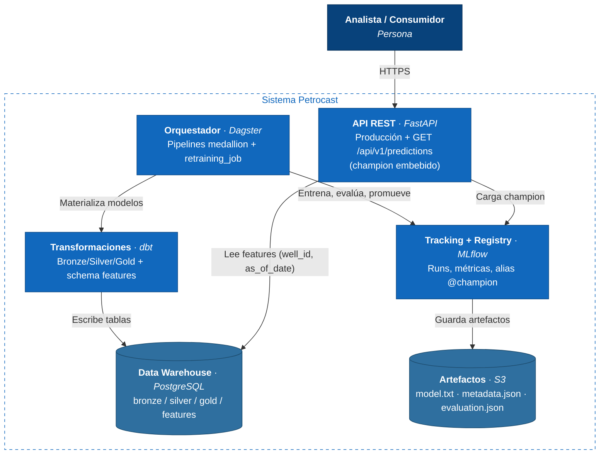

# Diagrama C4 — Contenedores

- **F2** — Dagster + dbt materializan las capas medallion en PostgreSQL.
- **F3** — `retraining_job` entrena LightGBM, evalúa gates y promueve el champion en MLflow; la API sirve ese champion leyendo features point-in-time del schema `features`.
