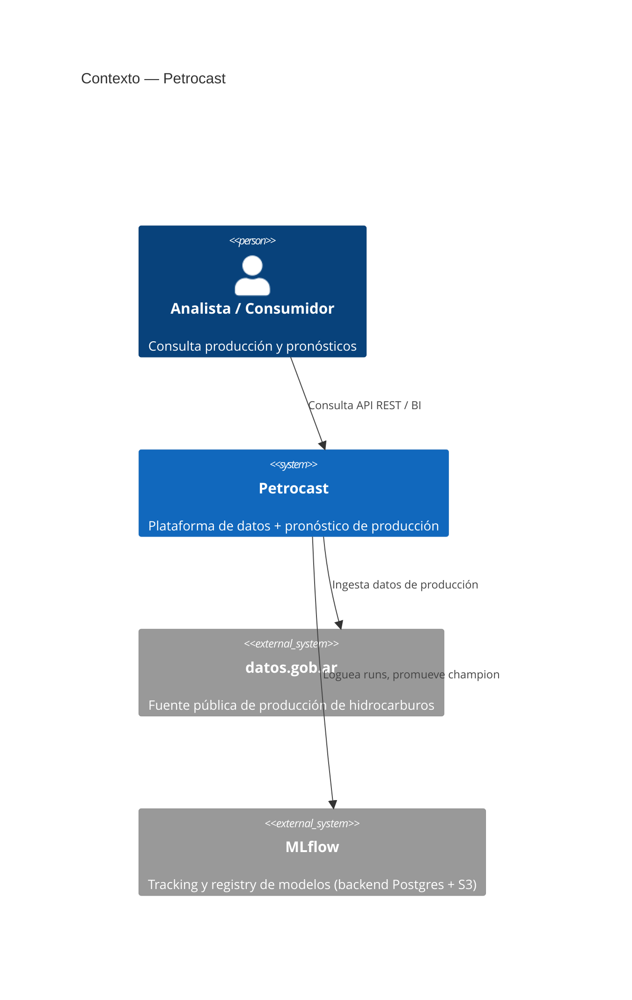

# Diagrama C4 — Contexto del sistema

Petrocast a través de las tres fases: ingesta y datos (F2), pronóstico ML (F3) y
API pública (F1+F3).

- **Fase 1** — API REST + observabilidad + despliegue AWS.
- **Fase 2** — plataforma de datos medallion (Bronze/Silver/Gold) con dbt + Dagster.
- **Fase 3** — vertical ML: feature store, entrenamiento, gates, registry y serving.
