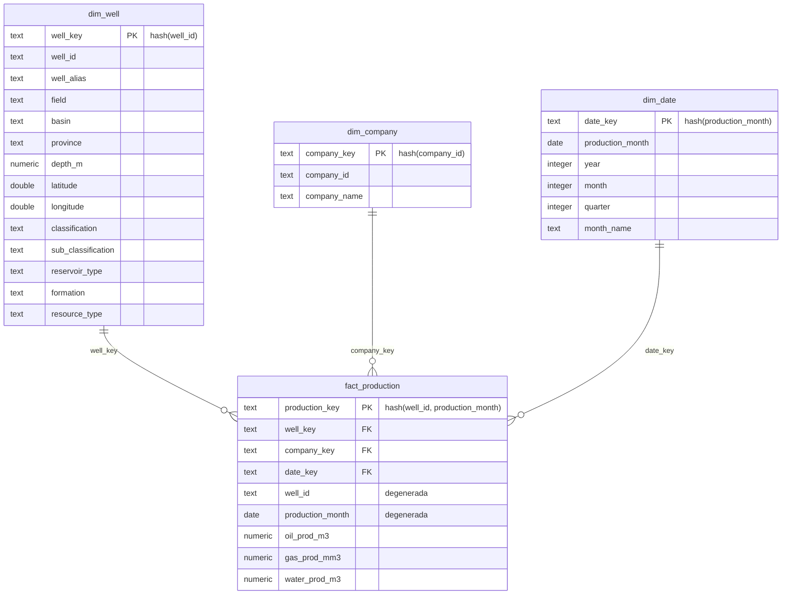
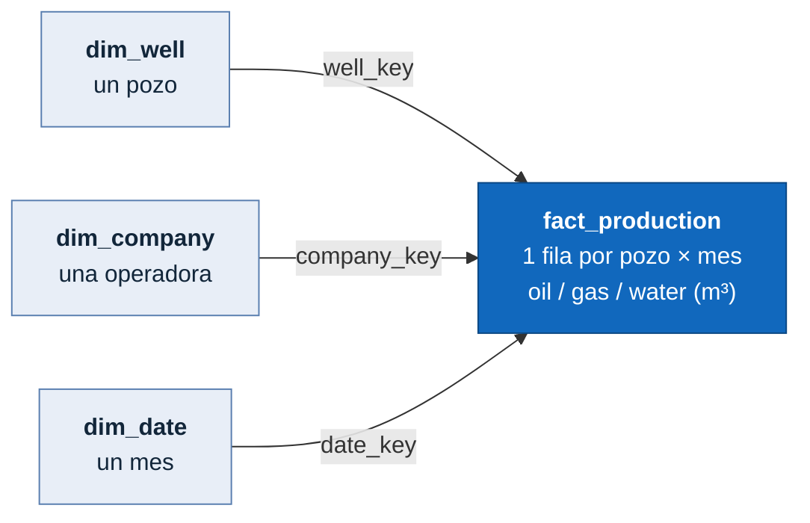

# Modelo de datos — capa Gold (star schema) — F2-25

- **Backlog:** F2-25 "Documentación del modelo de datos"
- **RNF:** RNF3 (documentación del modelo) + RNF11 (claridad para consumo no técnico)
- **ADR de referencia:** ADR-0024 (modelo dimensional), ADR-0023 (medallion + dbt),
  ADR-0026 (tipo de carga por capa)
- **Depende de:** F2-06 (ADR dimensional), F2-16 (implementación Gold)

## Propósito

Documenta el modelo dimensional de la capa `gold` que consumen Metabase
(dashboards) y la API (F2-22): el **grano** de la tabla de hechos, las
**dimensiones**, cómo se generan las **surrogate keys** y la decisión de
**historización (SCD)**. Es la referencia para construir consultas y dashboards
sin leer el SQL de los modelos dbt.

La implementación vive en `apps/data/dbt/models/gold/` (`fact_production`,
`dim_well`, `dim_company`, `dim_date`).

## Diagrama del star schema



Vista esquemática (fact central + 3 dimensiones desnormalizadas):



## Grano de la tabla de hechos

`fact_production` tiene grano de **una fila por pozo y mes de producción**
(`well_id` × `production_month`). Cada fila mide la producción del período:

| Medida          | Tipo    | Significado                         |
| --------------- | ------- | ----------------------------------- |
| `oil_prod_m3`   | numeric | Producción de petróleo del mes (m³) |
| `gas_prod_mm3`  | numeric | Producción de gas del mes (Mm³)     |
| `water_prod_m3` | numeric | Producción de agua del mes (m³)     |

La clave primaria `production_key` es un hash determinístico de
`(well_id, production_month)`, lo que fija el grano y habilita el upsert
idempotente. `well_id` y `production_month` quedan además como **dimensiones
degeneradas** en el hecho para filtrar sin join.

## Dimensiones

| Dimensión     | Grano         | Clave de negocio         | Surrogate key                         |
| ------------- | ------------- | ------------------------ | ------------------------------------- |
| `dim_well`    | un pozo       | `well_id` (idpozo)       | `well_key` = hash(`well_id`)          |
| `dim_company` | una operadora | `company_id` (idempresa) | `company_key` = hash(`company_id`)    |
| `dim_date`    | un mes        | `production_month`       | `date_key` = hash(`production_month`) |

- **`dim_well`** — universo = unión de pozos en `silver_wells` (registro) y
  `silver_production`, de modo que todo pozo del hecho tiene fila de dimensión
  (sin huecos de FK). Atributos del registro ganan sobre los derivados de
  producción en campos compartidos; `formation`/`resource_type` vienen de
  producción. Operadora es **dimensión propia** (`dim_company`), no atributo de
  `dim_well`, porque se repite en muchos pozos y se filtra por sí misma.
- **`dim_company`** — operadoras distintas presentes en `silver_production`.
- **`dim_date`** — calendario a grano mes, derivado de los `production_month`
  distintos; expone `year`, `month`, `quarter`, `month_name` para agrupar.

## Surrogate keys

Todas las claves se generan con **hash determinístico**
(`dbt_utils.generate_surrogate_key`) sobre la clave de negocio de cada entidad.
La **misma expresión de hash** se usa en el hecho y en las dimensiones, así las
FK resuelven los joins sin coordinar secuencias:

```sql
-- en fact_production y en dim_well: mismo hash → mismo well_key
{{ dbt_utils.generate_surrogate_key(["well_id"]) }} as well_key
```

Se eligió hash sobre autoincremental porque las SK quedan **estables y
reproducibles** entre corridas, particiones y backfills — requisito del
upsert/backfill idempotente (ADR-0023/0026). Trade-off: cambiar la definición de
una clave de negocio reescribe sus SK.

## Historización: SCD Tipo 1

Las tres dimensiones aplican **SCD Tipo 1** (overwrite): se conserva sólo el
último valor, no la historia. La carga es un **upsert por clave de negocio**
implementado en dbt incremental con `delete+insert` (equivalente seguro en
PostgreSQL a `ON CONFLICT ... DO UPDATE`): rematerializar una clave sobrescribe
su fila y no duplica.

Se eligió SCD1 porque las preguntas de la Fase 2 necesitan el **estado actual**
del pozo/operadora, no su historia. Consecuencia asumida: si un pozo cambia de
operadora, el valor anterior se pierde (no se puede reconstruir "quién operaba
en tal mes"). Migrar a SCD2 queda fuera de scope (ver ADR-0024).

## Idempotencia y reproceso

`fact_production` se materializa `delete+insert` por `production_key` y está
**particionada por mes** (vars `min_month`/`max_month`): el asset particionado de
Dagster las pasa por partición, habilitando **backfill por rango** sin duplicar.
Rerun de un período → mismo resultado.

## Integridad (tests dbt)

Definidos en `apps/data/dbt/models/gold/schema.yml`:

- `not_null` + `unique` sobre cada surrogate key (PK de fact y de cada dim).
- `relationships` de `well_key`/`company_key`/`date_key` del hecho hacia su
  dimensión → garantiza que no hay FK huérfanas.

## Referencias

- [ADR-0024](../adr/0024-modelo-dimensional-star-schema.md) — Modelo dimensional
  (forma star, dim_company propia, SK hash, SCD1).
- [ADR-0023](../adr/0023-arquitectura-medallion-dbt.md) — Arquitectura medallion
  con dbt Core v2.
- [ADR-0026](../adr/0026-tipo-carga-medallion.md) — Tipo de carga por capa
  (upsert por clave de negocio en gold).
- [docs/architecture/linaje.md](linaje.md) — Linaje navegable bronze→silver→gold.
- [apps/data/README.md](../../apps/data/README.md#gold-star-schema) — Notas de
  implementación de la capa Gold.
