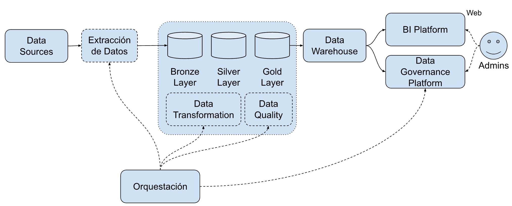

# Adenda Técnica Fase 2: Integración de Datos

## Contexto

En esta etapa se busca desarrollar la funcionalidad del sistema base junto con la base necesaria sobre la cual se llevará a cabo un desarrollo ágil.

## Arquitectura

## Usuarios y Casos de Uso

- Desarrolladores (devs)
  - Al crear PRs DEBEN recibir feedback sobre los tests del código.
- Usuarios de la API
  - DEBEN ser capaces de hacer uso del servicio mediante una API REST.
- Administradores (Admins)
  - DEBEN poder acceder vía web a una interfaz que muestre métricas relevantes a la ejecución del servicio.

## Requerimientos Funcionales

- DEBE haber un proceso de extracción de las fuentes de datos
  - Producción de Pozos de Gas y Petróleo No Convencional: https://datos.gob.ar/dataset/energia-produccion-petroleo-gas-por-pozo-capitulo-iv/archivo/energia_b5b58cdc-9e07-41f9-b392-fb9ec68b0725
  - Listado de pozos cargados por empresas operadoras (informacion complementaria):  https://datos.gob.ar/dataset/energia-produccion-petroleo-gas-por-pozo-capitulo-iv/archivo/energia_cbfa4d79-ffb3-4096-bab5-eb0dde9a8385
- Se DEBE utilizar la arquitectura medallion para procesar los datos.
- DEBE haber una plataforma de BI en la cual usuarios no técnicos puedan revisar los datos.
- DEBE haber una plataforma de gobierno de datos en la cual se puedan ver:
- Los workflows de extracción de datos
- Los datos en el data warehouse
- La última vez que los datos fueron actualizados
- DEBE haber una herramienta de orquestación con DAGs definidos como código (Airflow / Prefect / Dagster / equivalente).
- Los DAGs DEBEN tener idempotencia, retries con backoff y observabilidad mínima (logs y status accesibles).
- DEBE existir un procedimiento documentado y verificable de reprocesamiento histórico / backfill.
- DEBE definirse y justificarse explícitamente el tipo de carga (full / incremental append / merge / upsert) en un ADR.
- El sistema PUEDE implementar un semantic layer (dbt semantic layer, Cube.dev, vistas lógicas en el warehouse o similar) para exponer métricas de negocio definidas una sola vez (bonus).

## Requerimientos No Funcionales

- El repositorio DEBE incluir in archivo README.md con:
  - Instrucciones para:
    - Actualizar los workflows.
    - Acceder al sistema de BI y el de gobierno de datos.
- Descripción de la arquitectura de datos desarrollada.
- DEBE haber documentación del modelo de datos utilizado.
- DEBE haber chequeos de calidad de los datos que queden persistidos con mínimo 3 dimensiones de las vistas en clase, como schema y linaje.
- Los resultados del chequeo de calidad DEBEN quedar persistidos (no solo asserts en runtime) y fallar un check DEBE tener consecuencia operativa: alerta, bloqueo de promoción aguas abajo, o marca de calidad visible.
- El data warehouse DEBE utilizar el modelo estrella.
- DEBE ser posible reprocesar los datos de una fecha dado el caso de que haya cambios.
- El procesamiento de datos DEBE ser idempotente.
- DEBE haber algúna funcionalidad para seguir el linaje de los datos.
- La plataforma de gobierno DEBE estar implementada con alguna herramienta vista en clase o tutoría (DataHub). DEBE permitir navegar el lineage a nivel tabla. PUEDEN explorar alternativas si está debidamente justificado.
- DEBE haber documentación del modelo de datos que incluya: grano de la fact table, dimensiones, surrogate keys donde aplique, y decisión de SCD si las dimensiones cambian.

Además, el equipo DEBE elegir al menos 2 roles distintos de los vistos en clase, donde al menos uno sea de un perfil más cercano al negocio (data PM, data analyst, data owner, usuario de BI) y al menos uno más cercano a la implementación (data engineer, analytics engineer, data steward).

Para cada uno de esos roles, el equipo debe escribir un runbook [1](https://www.pagerduty.com/resources/automation/learn/what-is-a-runbook/)[2](https://en.wikipedia.org/wiki/Runbook)[3](https://www.pagerduty.com/resources/automation/learn/what-is-a-runbook/) dirigido a ese tipo de usuario, en docs/runbooks/ (un archivo por rol, p. ej. docs/runbooks/data-engineer.md y docs/runbooks/bi-user.md).

Cada runbook debe describir un procedimiento concreto y propio de ese rol dentro de este proyecto (no genérico), e incluir como mínimo:

- Propósito y disparador: para qué sirve y cuándo se ejecuta (cron, evento, incidente, pedido).
- Rol/dueño y prerrequisitos: quién lo corre, qué accesos/insumos/herramientas necesita.
- Pasos: el procedimiento numerado, ejecutable de punta a punta.
- Validación: cómo sabe el rol que salió bien (checks, queries de control, métrica esperada).
- Si algo falla: rollback, plan B y a quién/qué se escala.
- Consideraciones no funcionales: los límites y garantías que ese rol ownea o le importan: latencia/frescura, costo, seguridad/privacidad (PII), calidad de dato, SLAs, gobernanza.

El runbook debe dejar explícitas y justificadas (al menos un párrafo) dos decisiones del proyecto:

- Una funcional: una decisión sobre qué hace el procedimiento o el sistema (qué se transforma, qué métrica se define, qué se expone, qué se valida) que ese rol pushearía, ownearía o consumiría.
- Una no funcional: una decisión sobre cómo tiene que comportarse (cada cuánto corre, cuánto puede costar, qué nivel de privacidad/seguridad, qué umbral de calidad/disponibilidad) particularmente relevante para ese rol.

La justificación tiene que fundamentar por qué esa decisión, desde la perspectiva e incentivos del rol (no "porque es buena práctica").

Aclaraciones:

- Los ADRs que no lleven a cabo una comparación de alternativas o bien únicamente describen el camino tomado serán considerados inválidos y estarán a la evaluación del trabajo.
- Los ADRs DEBEN cubrir las decisiones clave de la Fase 2: orquestación, capas medallion, tipo de carga (full vs incremental), modelo dimensional, calidad de datos y gobierno de datos.
- Los ítems marcados como (bonus) no son obligatorios. Suman a la nota desde el aprobado hacia arriba, no compensan si la nota base no alcanza el umbral de aprobación.

Fecha de entrega: 15 de Junio
