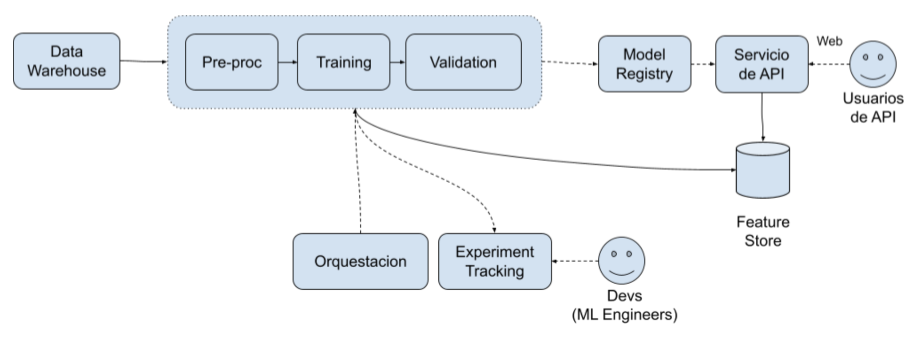

# Adenda Técnica Fase 3: Implementación de Modelo Predictivo

## Contexto

En esta etapa se integrará un modelo predictivo al desarrollo creado anteriormente.

## Arquitectura

## Usuarios y Casos de Uso

- Usuarios de API
  - DEBEN poder consumir una API REST que permita hacer uso del servicio.
- Devs (ML Engineers)
  - DEBEN poder acceder a una plataforma de tracking de experimentos de machine learning.

## Requerimientos Funcionales

- El servicio DEBE exponer una API.
- DEBE existir una plataforma que permita realizar tracking del entrenamiento de modelos de modo que el mismo sea reproducible.

## Requerimientos No Funcionales

- El procesamiento y generación de features DEBE quedar persistido en un feature store que será utilizado durante la inferencia.
- La arquitectura de la solución completa DEBE estar descripta en el README.md del proyecto.
- DEBE utilizarse alguna herramienta de orquestación que permita repetir el proceso de entrenamiento para un dia dado.
- El entrenamiento y despliegue de modelos DEBE realizarse de manera recurrente y automática.
- Los pipelines de procesamiento DEBEN desplegarse mediante un pipeline de CICD.

Además, como en las entregas anteriores, deben incluir un video de entre 5 y 10 minutos
explicando el desarrollo de esta fase 3 incluyendo diseño de arquitectura, herramientas usadas,
rationale de los puntos claves, explicación del valor agregado por el sistema, y otros elementos
conceptuales relevantes asociados a lo visto en la materia.

En este caso el trabajo se entrega sin servicio live en producción. Por esto es requisito que
demuestre en el video la demostración de la integración de los procesos de ML Eng para la API
de predicciones, por ejemplo con las métricas demostrando métricas de training en distintos
runs, ejemplos de llamadas a la API dando predicciones en distintos condiciones, y
demostrando el trigger de un retrain, entre otros.

## Aclaraciones

- Los ADRs que no lleven a cabo una comparación de alternativas o bien únicamente
describen el camino tomado serán considerados inválidos y estarán a la evaluación del
trabajo.
- Los ADRs DEBEN cubrir las decisiones clave de la Fase 3.

La fecha de entrega es hasta el 11 de Julio.
