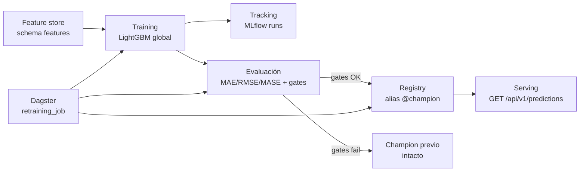

# README de Fase 3 — Vertical de Machine Learning Petrocast

Fase 3 agrega una vertical de pronóstico de producción de hidrocarburos sobre la
plataforma de datos de Fase 2: entrena un modelo, lo evalúa con gates de calidad,
lo promueve como champion y lo sirve por la API REST, con retraining orquestado.

## Arquitectura de la vertical ML

### Stack de herramientas

| Componente | Herramienta | Rol |
|---|---|---|
| Tracking de experimentos | MLflow OSS (backend Postgres/Supabase) | Runs, params, métricas, tags de contrato |
| Artefactos de modelo | S3 (`petrocast-ml-artifacts`) | `model.txt`, `metadata.json`, `evaluation.json` |
| Feature store | dbt sobre PostgreSQL, schema `features` | `well_features`, clave `(well_id, as_of_date)`, point-in-time |
| Modelo | LightGBM global | Pronóstico multi-horizonte de producción (m³) |
| Orquestación / retraining | Dagster | `retraining_job` particionado por `as_of_date` + `ScheduleDefinition` |
| Registry / promoción | MLflow Model Registry, alias `@champion` | Promoción con guard de gates + rollback |
| Serving | FastAPI (embebido) | `GET /api/v1/predictions` carga `models:/petrocast-production@champion` |
| CI/CD ML | GitHub Actions + ECR | Smokes de entrenamiento→registro→inferencia, imagen `petrocast/ml` |

### Flujo end-to-end



Clave de diseño: un retrain que no pasa los gates de calidad **no pisa** el champion
vigente; el candidato queda trazado en MLflow pero el alias no se mueve.

## Decisiones (ADRs)

| ADR | Decisión |
|---|---|
| [ADR-0030](../adr/0030-objetivo-predictivo-horizonte-metricas.md) | Objetivo predictivo, horizonte y métricas de evaluación (MAE/RMSE/MASE + gates) |
| [ADR-0031](../adr/0031-estrategia-feature-store.md) | Estrategia de feature store (dbt, schema `features`, point-in-time) |
| [ADR-0032](../adr/0032-tracking-experimentos-registry.md) | Tracking de experimentos y registry de modelos con MLflow |
| [ADR-0033](../adr/0033-orquestacion-entrenamiento-retraining.md) | Orquestación del entrenamiento y retraining con Dagster |
| [ADR-0034](../adr/0034-serving-modelo-contrato-api.md) | Serving del modelo embebido en FastAPI y contrato de API predictiva |
| [ADR-0035](../adr/0035-cicd-pipelines-ml-promocion.md) | CI/CD de pipelines ML y promoción de artefactos |

## Cómo correr

Los comandos completos con servicios locales están en
[`demo-tracking-api.md`](demo-tracking-api.md) y en [`apps/ml/README.md`](../../apps/ml/README.md).
Resumen operativo:

### Tracking (entrenar y loguear un run)

```bash
docker compose --env-file apps/data/.env \
  -f infra/compose.data.yml -f infra/compose.mlflow.yml \
  up --build data-postgres mlflow dagster
# MLflow UI en http://localhost:5000 — ver apps/ml/README.md para el CLI con --track
```

### Retraining (job Dagster)

```bash
# CLI: materializa features → training → evaluation → promotion
PARTITION=2026-01-01 infra/scripts/demo/f3-21-demo-evidence.sh retrain-cli
# o desde la UI de Dagster (http://localhost:3000): Jobs → retraining_job → partición → Launch
```

### API de predicciones

```bash
curl -H "X-API-Key: abcdef12345" \
  "http://localhost:8000/api/v1/predictions?id_well=POZO-001&as_of_date=2024-03-15&horizon=3"
```

## Guion / checklist de video

Video de la entrega: **TBD** (agregar link de YouTube tras la grabación).

Guion sugerido (ver evidencia detallada en [`demo-tracking-api.md`](demo-tracking-api.md)):

1. **Tracking** — MLflow UI con dos runs de métricas distintas; abrir un run y mostrar params, métricas (`model_mae_m3`, `naive_mae_m3`), tags (`as_of_date`, `features_version`, `git_commit`) y artefactos.
2. **Gates de calidad** — mostrar el veredicto de gates (MASE vs naive, ratio, gap vs Arps) del [reporte de backtesting](backtesting-report.md).
3. **API** — un `GET /api/v1/predictions` con respuesta `200` y `model_version`; un error controlado (`404` pozo sin features o `422` horizonte inválido).
4. **Retraining** — trigger manual de `retraining_job` en Dagster; explicar que un retrain que falla los gates no pisa el champion (`models:/petrocast-production@champion`).

Checklist:

- [ ] MLflow UI con dos runs y métricas diferentes.
- [ ] Detalle de un run (params, métricas, tags, artefactos).
- [ ] API respondiendo una predicción exitosa con `model_version`.
- [ ] API mostrando un error controlado (`404`/`422`).
- [ ] Dagster mostrando trigger manual de `retraining_job`.
- [ ] Explicación: un retrain fallido no pisa el champion vigente.

## Mapa de documentación de Fase 3

| Documento | Qué cubre |
|---|---|
| [`model-card.md`](model-card.md) | Model card del champion `petrocast-production` |
| [`backtesting-report.md`](backtesting-report.md) | Reporte de backtesting y gates de calidad |
| [`demo-tracking-api.md`](demo-tracking-api.md) | Guía de evidencia demo (tracking, API, retraining) |
| [`apps/ml/README.md`](../../apps/ml/README.md) | Guía del paquete ML: features, training, tracking, registry, inferencia |
| [`docs/runbooks/ml-promotion.md`](../runbooks/ml-promotion.md) | Promoción y rollback del champion |
| [`docs/adr/README.md`](../adr/README.md) | Índice completo de ADRs |
