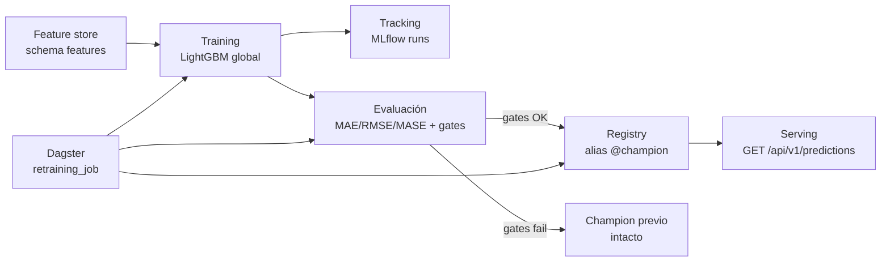
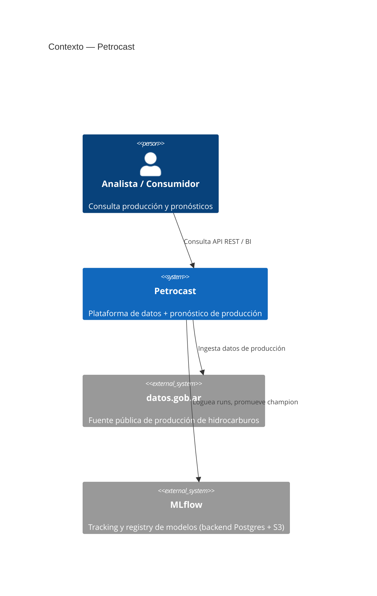
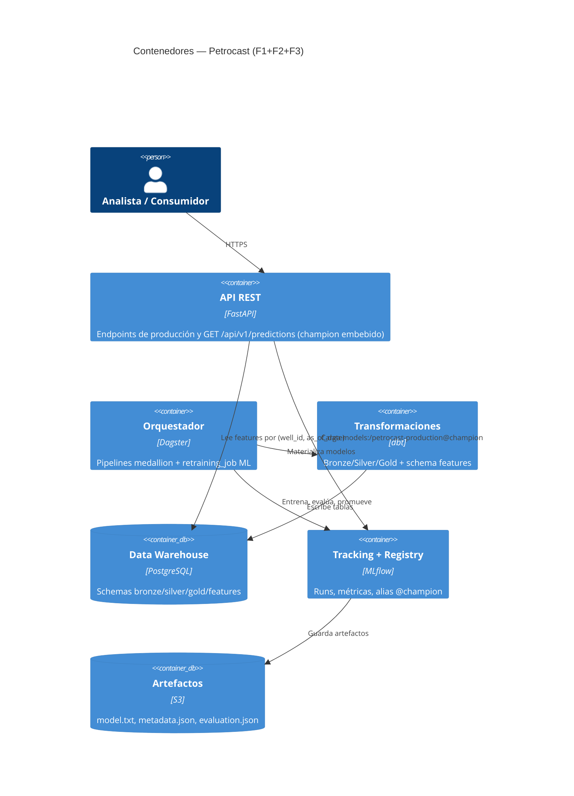

# F3-24 — README Fase 3, arquitectura y guion de video — Implementation Plan

> **For agentic workers:** REQUIRED SUB-SKILL: Use superpowers:subagent-driven-development (recommended) or superpowers:executing-plans to implement this plan task-by-task. Steps use checkbox (`- [ ]`) syntax for tracking.

**Goal:** Cerrar F3-24 (#127) — documentación de cierre de Fase 3: hub de Fase 3, diagramas C4 F1+F2+F3, README raíz actualizado y guion de video.

**Architecture:** Solo-docs. Se crea `docs/fase-3/README.md` (hub calcado del patrón de `docs/fase-2/README.md`), se pueblan los C4 vacíos con la vertical ML, se actualiza el README raíz y se agrega un cross-link en Fase 2. Todo lo técnico ya existe como código/artefactos y se enlaza, no se duplica.

**Tech Stack:** Markdown, diagramas Mermaid, links relativos. Sin cambios de código.

## Global Constraints

- **Español con acentos correctos** en toda la prosa (convención del repo).
- **Video:** solo guion + placeholder `TBD` para el link de YouTube. No se graba.
- **Diagramas:** poblar los archivos C4 **existentes** (`c4-context.md`, `c4-containers.md`), que hoy están vacíos. No crear un C4 nuevo dedicado.
- **No duplicar** el contenido de `model-card.md`, `backtesting-report.md`, `demo-tracking-api.md`, `apps/ml/README.md` ni el runbook `ml-promotion.md`: enlazarlos.
- **Links relativos válidos:** todo link a archivo del repo debe resolver a un archivo existente.
- Rama de trabajo ya creada: `docs/f3-24-readme-arquitectura` (el spec ya está commiteado ahí).
- ADRs a enlazar (títulos exactos, verbatim):
  - ADR-0030 — Objetivo predictivo, horizonte y métricas de evaluación
  - ADR-0031 — Estrategia de feature store
  - ADR-0032 — Tracking de experimentos y registry de modelos con MLflow
  - ADR-0033 — Orquestación del entrenamiento y retraining con Dagster
  - ADR-0034 — Serving del modelo embebido en FastAPI y contrato de API predictiva
  - ADR-0035 — CI/CD de pipelines ML y promoción de artefactos

---

## Verificación de links (helper usado en varias tareas)

Comando reutilizable para validar que los links relativos de un markdown resuelven a archivos existentes (ejecutar desde la raíz del repo). Reemplazar `<FILE>` por el archivo a chequear:

```bash
python3 - "<FILE>" <<'PY'
import re, sys, pathlib
f = pathlib.Path(sys.argv[1]); base = f.parent
missing = []
for m in re.finditer(r'\]\(([^)]+)\)', f.read_text(encoding='utf-8')):
    link = m.group(1).split('#')[0].strip()
    if not link or link.startswith(('http://','https://','mailto:')): continue
    if not (base / link).resolve().exists(): missing.append(link)
print("MISSING:", missing) if missing else print("OK: todos los links relativos resuelven")
PY
```

Expected en cada uso: `OK: todos los links relativos resuelven`.

---

## Task 1: Crear `docs/fase-3/README.md` (hub de Fase 3)

**Files:**

- Create: `docs/fase-3/README.md`

**Interfaces:**

- Consumes: docs existentes de Fase 3 — `docs/fase-3/model-card.md`, `docs/fase-3/backtesting-report.md`, `docs/fase-3/demo-tracking-api.md`; `docs/runbooks/ml-promotion.md`; `apps/ml/README.md`; ADRs `docs/adr/0030..0035-*.md`.
- Produces: `docs/fase-3/README.md`, enlazado luego desde el README raíz (Task 3) y Fase 2 (Task 4).

- [ ] **Step 1: Escribir `docs/fase-3/README.md`**

Estructura obligatoria (headings exactos) y contenido:

````markdown
# README de Fase 3 — Vertical de Machine Learning Petrocast

Fase 3 agrega una vertical de pronóstico de producción de hidrocarburos sobre la
plataforma de datos de Fase 2: entrena un modelo, lo evalúa con gates de calidad,
lo promueve como champion y lo sirve por la API REST, con retraining orquestado.

## Arquitectura de la vertical ML

### Stack de herramientas

| Componente | Herramienta | Rol |
|---|---|---|
| Tracking de experimentos | MLflow OSS (backend Postgres/Supabase) | Runs, params, métricas, tags de contrato |
| Artefactos de modelo | S3 (`petrocast-ml-artifacts`) | `model.txt`, `metadata.json`, `evaluation.json` |
| Feature store | dbt sobre PostgreSQL, schema `features` | `well_features`, clave `(well_id, as_of_date)`, point-in-time |
| Modelo | LightGBM global | Pronóstico multi-horizonte de producción (m³) |
| Orquestación / retraining | Dagster | `retraining_job` particionado por `as_of_date` + `ScheduleDefinition` |
| Registry / promoción | MLflow Model Registry, alias `@champion` | Promoción con guard de gates + rollback |
| Serving | FastAPI (embebido) | `GET /api/v1/predictions` carga `models:/petrocast-production@champion` |
| CI/CD ML | GitHub Actions + ECR | Smokes de entrenamiento→registro→inferencia, imagen `petrocast/ml` |

### Flujo end-to-end



Clave de diseño: un retrain que no pasa los gates de calidad **no pisa** el champion
vigente; el candidato queda trazado en MLflow pero el alias no se mueve.

## Decisiones (ADRs)

| ADR | Decisión |
|---|---|
| [ADR-0030](../adr/0030-objetivo-predictivo-horizonte-metricas.md) | Objetivo predictivo, horizonte y métricas de evaluación (MAE/RMSE/MASE + gates) |
| [ADR-0031](../adr/0031-estrategia-feature-store.md) | Estrategia de feature store (dbt, schema `features`, point-in-time) |
| [ADR-0032](../adr/0032-tracking-experimentos-registry.md) | Tracking de experimentos y registry de modelos con MLflow |
| [ADR-0033](../adr/0033-orquestacion-entrenamiento-retraining.md) | Orquestación del entrenamiento y retraining con Dagster |
| [ADR-0034](../adr/0034-serving-modelo-contrato-api.md) | Serving del modelo embebido en FastAPI y contrato de API predictiva |
| [ADR-0035](../adr/0035-cicd-pipelines-ml-promocion.md) | CI/CD de pipelines ML y promoción de artefactos |

## Cómo correr

Los comandos completos con servicios locales están en
[`demo-tracking-api.md`](demo-tracking-api.md) y en [`apps/ml/README.md`](../../apps/ml/README.md).
Resumen operativo:

### Tracking (entrenar y loguear un run)

```bash
docker compose --env-file apps/data/.env \
  -f infra/compose.data.yml -f infra/compose.mlflow.yml \
  up --build data-postgres mlflow dagster
# MLflow UI en http://localhost:5000 — ver apps/ml/README.md para el CLI con --track
```

### Retraining (job Dagster)

```bash
# CLI: materializa features → training → evaluation → promotion
PARTITION=2026-01-01 infra/scripts/demo/f3-21-demo-evidence.sh retrain-cli
# o desde la UI de Dagster (http://localhost:3000): Jobs → retraining_job → partición → Launch
```

### API de predicciones

```bash
curl -H "X-API-Key: abcdef12345" \
  "http://localhost:8000/api/v1/predictions?id_well=POZO-001&as_of_date=2024-03-15&horizon=3"
```

## Guion / checklist de video

Video de la entrega: **TBD** (agregar link de YouTube tras la grabación).

Guion sugerido (ver evidencia detallada en [`demo-tracking-api.md`](demo-tracking-api.md)):

1. **Tracking** — MLflow UI con dos runs de métricas distintas; abrir un run y mostrar params, métricas (`model_mae_m3`, `naive_mae_m3`), tags (`as_of_date`, `features_version`, `git_commit`) y artefactos.
2. **Gates de calidad** — mostrar el veredicto de gates (MASE vs naive, ratio, gap vs Arps) del [reporte de backtesting](backtesting-report.md).
3. **API** — un `GET /api/v1/predictions` con respuesta `200` y `model_version`; un error controlado (`404` pozo sin features o `422` horizonte inválido).
4. **Retraining** — trigger manual de `retraining_job` en Dagster; explicar que un retrain que falla los gates no pisa el champion (`models:/petrocast-production@champion`).

Checklist:

- [ ] MLflow UI con dos runs y métricas diferentes.
- [ ] Detalle de un run (params, métricas, tags, artefactos).
- [ ] API respondiendo una predicción exitosa con `model_version`.
- [ ] API mostrando un error controlado (`404`/`422`).
- [ ] Dagster mostrando trigger manual de `retraining_job`.
- [ ] Explicación: un retrain fallido no pisa el champion vigente.

## Mapa de documentación de Fase 3

| Documento | Qué cubre |
|---|---|
| [`model-card.md`](model-card.md) | Model card del champion `petrocast-production` |
| [`backtesting-report.md`](backtesting-report.md) | Reporte de backtesting y gates de calidad |
| [`demo-tracking-api.md`](demo-tracking-api.md) | Guía de evidencia demo (tracking, API, retraining) |
| [`apps/ml/README.md`](../../apps/ml/README.md) | Guía del paquete ML: features, training, tracking, registry, inferencia |
| [`docs/runbooks/ml-promotion.md`](../runbooks/ml-promotion.md) | Promoción y rollback del champion |
| [`docs/adr/README.md`](../adr/README.md) | Índice completo de ADRs |
````

- [ ] **Step 2: Verificar links del hub**

Run: el helper de "Verificación de links" con `<FILE>` = `docs/fase-3/README.md`.
Expected: `OK: todos los links relativos resuelven`.

- [ ] **Step 3: Verificar headings**

Run: `grep -nE '^#{1,3} ' docs/fase-3/README.md`
Expected: aparecen `Arquitectura de la vertical ML`, `Decisiones (ADRs)`, `Cómo correr`, `Guion / checklist de video`, `Mapa de documentación de Fase 3`.

- [ ] **Step 4: Commit**

```bash
git add docs/fase-3/README.md
git commit -m "docs(fase-3): agregar hub README de Fase 3 (arquitectura ML + guion video)"
```

---

## Task 2: Poblar diagramas C4 con la vertical ML (F1+F2+F3)

**Files:**

- Modify: `docs/architecture/c4-context.md` (hoy vacío)
- Modify: `docs/architecture/c4-containers.md` (hoy vacío)

**Interfaces:**

- Consumes: nada de tareas previas.
- Produces: diagramas C4 poblados, ya enlazados desde el README raíz y Fase 2.

- [ ] **Step 1: Escribir `docs/architecture/c4-context.md`**

````markdown
# Diagrama C4 — Contexto del sistema

Petrocast a través de las tres fases: ingesta y datos (F2), pronóstico ML (F3) y
API pública (F1+F3).



- **Fase 1** — API REST + observabilidad + despliegue AWS.
- **Fase 2** — plataforma de datos medallion (Bronze/Silver/Gold) con dbt + Dagster.
- **Fase 3** — vertical ML: feature store, entrenamiento, gates, registry y serving.
````

- [ ] **Step 2: Escribir `docs/architecture/c4-containers.md`**

````markdown
# Diagrama C4 — Contenedores



- **F2** — Dagster + dbt materializan las capas medallion en PostgreSQL.
- **F3** — `retraining_job` entrena LightGBM, evalúa gates y promueve el champion en MLflow; la API sirve ese champion leyendo features point-in-time del schema `features`.
````

- [ ] **Step 3: Verificar que ya no están vacíos y el mermaid está presente**

Run: `for f in docs/architecture/c4-context.md docs/architecture/c4-containers.md; do echo "== $f =="; test -s "$f" && grep -c '```mermaid' "$f"; done`
Expected: cada archivo con tamaño > 0 y al menos `1` bloque ` ```mermaid `.

- [ ] **Step 4: Commit**

```bash
git add docs/architecture/c4-context.md docs/architecture/c4-containers.md
git commit -m "docs(architecture): poblar C4 de contexto y contenedores con la vertical ML (F3)"
```

---

## Task 3: Actualizar `README.md` raíz

**Files:**

- Modify: `README.md`

**Interfaces:**

- Consumes: `docs/fase-3/README.md` (Task 1) para el link de Documentación.
- Produces: README raíz reflejando Fase 3 completa.

- [ ] **Step 1: Completar la sección `## Descripción` (hoy vacía, línea 5-6)**

Reemplazar el bloque vacío por:

```markdown
## Descripción

Petrocast es una plataforma de datos y pronóstico de producción de hidrocarburos
construida sobre datos públicos de `datos.gob.ar`. Integra una API REST (Fase 1),
una plataforma de datos medallion con dbt + Dagster (Fase 2) y una vertical de
machine learning que entrena, evalúa, promueve y sirve un modelo de pronóstico de
producción vía `GET /api/v1/predictions` (Fase 3).
```

- [ ] **Step 2: Agregar sección de video de Fase 3 (después de "Video Entrega Adenda Fase 2", línea 13)**

Insertar tras la línea del video de Fase 2:

```markdown
## Video Entrega Adenda Fase 3

Demo del proyecto disponible en YouTube: **TBD** (pendiente de grabación).
```

- [ ] **Step 3: Agregar link a Fase 3 en `## Documentación`**

Tras la línea `- [README de Fase 2](docs/fase-2/README.md)` agregar:

```markdown
- [README de Fase 3 — vertical ML](docs/fase-3/README.md)
```

- [ ] **Step 4: Actualizar la fila de Fase 3 en la tabla `## Estado por fase`**

Reemplazar la fila:

```markdown
| Fase 3 | 2026-06-30 | ⏳ Pendiente     | —                                  |
```

por:

```markdown
| Fase 3 | 2026-07-11 | ✅ Completa      | [guion](docs/fase-3/README.md#guion--checklist-de-video) |
```

- [ ] **Step 5: Ampliar "Paquete de machine learning" en `## Cómo ejecutar`**

Reemplazar el párrafo actual de la subsección `### Paquete de machine learning` por:

```markdown
### Paquete de machine learning

El paquete compartido `apps/ml` concentra los contratos de features,
entrenamiento, tracking, registry e inferencia usados por Data y API. La guía de
configuración y los comandos locales están en [apps/ml/README.md](apps/ml/README.md).

Operación de la vertical ML (detalle en [docs/fase-3/README.md](docs/fase-3/README.md)):

```bash
# Tracking + retraining (MLflow en :5000, Dagster en :3000)
docker compose --env-file apps/data/.env \
  -f infra/compose.data.yml -f infra/compose.mlflow.yml \
  up --build data-postgres mlflow dagster

# Retraining por CLI (features → training → evaluación → promoción)
PARTITION=2026-01-01 infra/scripts/demo/f3-21-demo-evidence.sh retrain-cli

# API de predicciones (con la API levantada)
curl -H "X-API-Key: abcdef12345" \
  "http://localhost:8000/api/v1/predictions?id_well=POZO-001&as_of_date=2024-03-15&horizon=3"
```

```

- [ ] **Step 6: Verificar links del README raíz**

Run: el helper de "Verificación de links" con `<FILE>` = `README.md`.
Expected: `OK: todos los links relativos resuelven`.

- [ ] **Step 7: Verificar que no quedó la descripción vacía ni el estado pendiente**

Run: `grep -nE '⏳ Pendiente|^## Descripción$' README.md; grep -n 'Fase 3' README.md`
Expected: NO aparece `⏳ Pendiente` en la fila de Fase 3; la fila de Fase 3 muestra `✅ Completa`; existe `## Video Entrega Adenda Fase 3`.

- [ ] **Step 8: Commit**

```bash
git add README.md
git commit -m "docs(readme): reflejar Fase 3 completa (descripción, estado, video, comandos ML)"
```

---

## Task 4: Cross-link en Fase 2 + verificación final + PR

**Files:**

- Modify: `docs/fase-2/README.md`

**Interfaces:**

- Consumes: `docs/fase-3/README.md` (Task 1).
- Produces: PR `Closes #127`.

- [ ] **Step 1: Agregar fila a la tabla `## Mapa de documentación` de Fase 2**

En la tabla de "Mapa de documentación" de `docs/fase-2/README.md`, agregar una fila:

```markdown
| [`docs/fase-3/README.md`](../fase-3/README.md) | Vertical de ML de Fase 3 (arquitectura, cómo correr, guion de video) |
```

- [ ] **Step 2: Verificar link de Fase 2**

Run: el helper de "Verificación de links" con `<FILE>` = `docs/fase-2/README.md`.
Expected: `OK: todos los links relativos resuelven`.

- [ ] **Step 3: Verificación global de todos los docs tocados**

Run (desde la raíz):

```bash
for f in README.md docs/fase-2/README.md docs/fase-3/README.md \
         docs/architecture/c4-context.md docs/architecture/c4-containers.md; do
  echo "== $f =="
  python3 - "$f" <<'PY'
import re, sys, pathlib
f = pathlib.Path(sys.argv[1]); base = f.parent
missing = [l for m in re.finditer(r'\]\(([^)]+)\)', f.read_text(encoding='utf-8'))
          for l in [m.group(1).split('#')[0].strip()]
          if l and not l.startswith(('http','mailto:')) and not (base/l).resolve().exists()]
print("MISSING:", missing) if missing else print("OK")
PY
done
```

Expected: `OK` para los 5 archivos.

- [ ] **Step 4: Commit**

```bash
git add docs/fase-2/README.md
git commit -m "docs(fase-2): cross-link al README de Fase 3"
```

- [ ] **Step 5: Push y abrir PR**

```bash
git push -u origin docs/f3-24-readme-arquitectura
gh pr create --title "[F3-24] README Fase 3, arquitectura completa y guion de video" \
  --body "Closes #127

Cierre documental de Fase 3:
- Nuevo \`docs/fase-3/README.md\` (hub: arquitectura ML, ADRs 0030-0035, cómo correr tracking/retrain/API, guion de video).
- Poblados los diagramas C4 (\`c4-context.md\`, \`c4-containers.md\`) con la vertical ML.
- README raíz: descripción, Fase 3 ✅, sección de video, comandos ML.
- Cross-link en \`docs/fase-2/README.md\`.

Solo-docs, sin cambios de código." \
  --milestone "Fase 3 — Adenda 3"
```

- [ ] **Step 6: Completar metadata de la PR (labels + assignee)**

```bash
PR=$(gh pr view --json number --jq .number)
gh api --method POST "repos/joaquinleondev/petrocast/issues/$PR/labels" -f 'labels[]=docs' -f 'labels[]=demo' -f 'labels[]=arquitectura'
gh api --method POST "repos/joaquinleondev/petrocast/issues/$PR/assignees" -f 'assignees[]=joaquinleondev'
```

Expected: la PR queda con milestone M6, labels `docs`/`demo`/`arquitectura` y assignee. (Si `gh pr edit` falla por el bug de "projects classic" conocido en este repo, usar la API REST como arriba.)

---

## Self-Review (completado por el autor del plan)

- **Spec coverage:** los 5 criterios de #127 mapean a tareas — arquitectura F1+F2+F3 (Task 1 + Task 2 + Task 3 Step 1), links a ADRs 0030–0035 (Task 1), cómo correr tracking/retrain/API (Task 1 + Task 3 Step 5), guion de video (Task 1), actualizar docs de fase (Task 2 crosslink en Task 4). ✓
- **Placeholder scan:** los únicos `TBD` son el link de video, intencional por decisión del usuario. Sin otros placeholders. ✓
- **Type/nombre consistency:** paths de archivos, nombres de ADRs, comandos y anchors (`#guion--checklist-de-video`) verificados contra el repo real. ✓
- **Ajuste de alcance detectado:** los C4 estaban vacíos → Task 2 los **crea** en vez de editar; sigue respetando "extender los existentes" (mismos paths, no C4 nuevo). ✓
